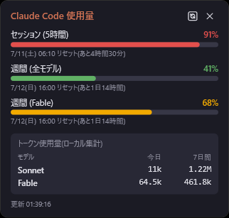

# YMB Claude使用量モニター

Claude Code の使用量(5時間セッション制限・週間制限・モデル別トークン消費)を
常時デスクトップに表示する Windows 常駐ウィジェット。C# + WPF製。



## 主な機能

- **デスクトップ常駐表示**: 枠なしのダークウィジェット(幅320px)。壁紙の上(WorkerW層)に
  固定するデスクトップピン留めに対応(`Native/DesktopPin.cs`)。WorkerW検出に失敗した場合は
  通常ウィンドウ表示にフォールバックする。
- **API制限バケットの表示**: セッション(5時間)・週間(全モデル)・週間(モデル別、例: Fable)の
  使用率をバーで表示。レスポンスのキー名を固定せず `{utilization, resets_at}` 形のオブジェクトを
  動的に拾い、さらに `limits` 配列のモデルスコープ付き枠(`scope.model.display_name`)も
  バケットとして追加する実装(`Services/UsageApiClient.cs`)のため、Anthropic側で
  モデル別枠が増えても表示に反映できる。
  使用率80%以上は赤、50%以上は黄、それ未満は緑のバーで警告度を表現。
- **ローカルJSONL集計**: `~/.claude/projects/**/*.jsonl` を走査し、モデル別(Sonnet/Opus/Fable/Haiku等)の
  今日・7日間のトークン消費量を集計・表示。ファイルのmtime+サイズによるキャッシュと、
  `message.id` + `requestId` による重複排除で高速かつ正確に集計する
  (`Services/LocalUsageScanner.cs`)。
- **トレイアイコン**: 常駐時は使用率に応じて色が変わる円グラフアイコン(緑→黄→赤)を表示。
- **自動更新**: ローカル集計は1分ごと、APIは既定5分間隔(設定で変更可)。トレイメニューまたは
  ヘッダーの🔄ボタンで即時更新も可能。
- **単一インスタンス**: Mutexにより多重起動を防止。

## データ源(2系統)

1. **OAuth使用量API**(`GET https://api.anthropic.com/api/oauth/usage`)
   Claude Code CLIと同じOAuthトークンで、公式の制限バケット(セッション/週間などの`utilization`・
   `resets_at`、および `limits` 配列のモデル別週間枠)を取得する。
2. **ローカルJSONL集計**(`~/.claude/projects/**/*.jsonl`)
   Claude Codeが実行時に書き出すログを直接走査し、モデル別の入力/出力/キャッシュ読取トークン数を
   自前で積算する。API側にモデル別内訳が出ない場合でも、こちらで実際の使用傾向を確認できる。

## 認証の仕組み

- Claude Code CLIが保存する `~/.claude/.credentials.json` の `claudeAiOauth` をそのまま読み込む
  (別途ログイン不要)。
- アクセストークンの有効期限が5分未満に迫ったら、`refreshToken` を使い
  `https://console.anthropic.com/v1/oauth/token` へ自動リフレッシュ要求を送る
  (client_id はClaude Code公開OAuthクライアントIDを使用)。
- 更新に成功したら `accessToken` / `refreshToken` / `expiresAt` を同ファイルへ書き戻す
  (他のキーは保持したまま。Claude Code CLI側の資格情報とも整合が取れる)。
- リフレッシュ要求が **429(レート制限)** を返した場合は10分間バックオフし、その間は
  古いアクセストークンでAPI呼び出しを試みる。バックオフ明け後に自動で再試行するため、
  一時的な429は放置しても自己回復する設計。

## 使い方

トレイアイコンを右クリックすると以下のメニューが出る。

- **表示/非表示**: ウィジェットの表示切り替え(トレイアイコンのダブルクリックでも可)。
- **今すぐ更新**: API・ローカル集計を即時再取得(ヘッダー右の🔄ボタンでも可)。
- **常に最前面**: 通常ウィンドウとして最前面固定するかどうか(デスクトップピン留め中は無効)。
- **壁紙に固定 (WorkerW)**: 壁紙の上に固定表示。有効時は「常に最前面」より優先される。
- **表示モード**: パネル配置の切替。
- **終了**: アプリを終了。

ウィジェット本体はヘッダー部分をドラッグすることで移動できる(位置は自動保存される)。

## 開発環境

```
cd src/ClaudeUsage.App
dotnet build
dotnet run
```

## 技術スタック

- **言語/フレームワーク**: C# / .NET 10 (`net10.0-windows`) + WPF
- **トレイアイコン**: Windows Forms の `NotifyIcon`(`UseWindowsForms`併用)
- **デスクトップ常駐**: Progman/WorkerWトリック(`Native/DesktopPin.cs`、user32.dll P/Invoke)
- **使用量API**: `GET https://api.anthropic.com/api/oauth/usage`
  (`Authorization: Bearer <accessToken>` / `anthropic-beta: oauth-2025-04-20`)
- **OAuthトークン更新**: `POST https://console.anthropic.com/v1/oauth/token`(refresh_token grant)
- **設定/データ永続化**: JSON、DB不使用

## データ保存先

- 設定ファイル: `%APPDATA%\YmbClaudeUsage\settings.json`
  (ウィンドウ位置、常に最前面、デスクトップピン留め、API更新間隔、不透明度、表示モード)
- 認証情報: `~/.claude/.credentials.json`(Claude Code CLIと共用、本アプリは読み書きのみ行い
  新規作成はしない)

## ダウンロード

ビルド不要で使う場合は [Releases](https://github.com/yumebi/ymb_claude_usage/releases/latest) から
`YmbClaudeUsage-Setup-<version>.exe` をダウンロードして実行するだけでインストールできる。

> **注意**: このインストーラーはコード署名されていません。ダウンロード・実行時に
> Windows SmartScreenが「不明な発行元」として警告を表示する場合があります。
> 「詳細情報」→「実行」で続行できます。

> **.NET 10 Desktop Runtime が必要です**: 配布サイズと常駐メモリを抑えるため、フレームワーク依存
> ビルド(ランタイム非同梱)で配布しています。未インストールの場合は初回起動時に自動でインストーラーへ
> 誘導するダイアログが表示されます(.NET Runtime の標準挙動)。事前に入れておきたい場合は
> [.NET 10 Desktop Runtime (x64)](https://dotnet.microsoft.com/download/dotnet/10.0) を
> インストールしてください。
>
> **旧バージョンからの更新で「.NET をインストールしてください」ダイアログが出る場合**: v1.0.4以前から
> 上書きインストールすると、インストーラーの不具合により旧バージョン(self-containedビルド)の
> ランタイムファイルが残留し、正しく.NETが入っていても起動できないことがあります。発生した場合は
> 一度アンインストールしてから最新版を入れ直してください(v1.0.5以降はアップグレード時に自動で
> 解消されます)。

## ライセンス

[MIT License](LICENSE) © 2026 yumebi
